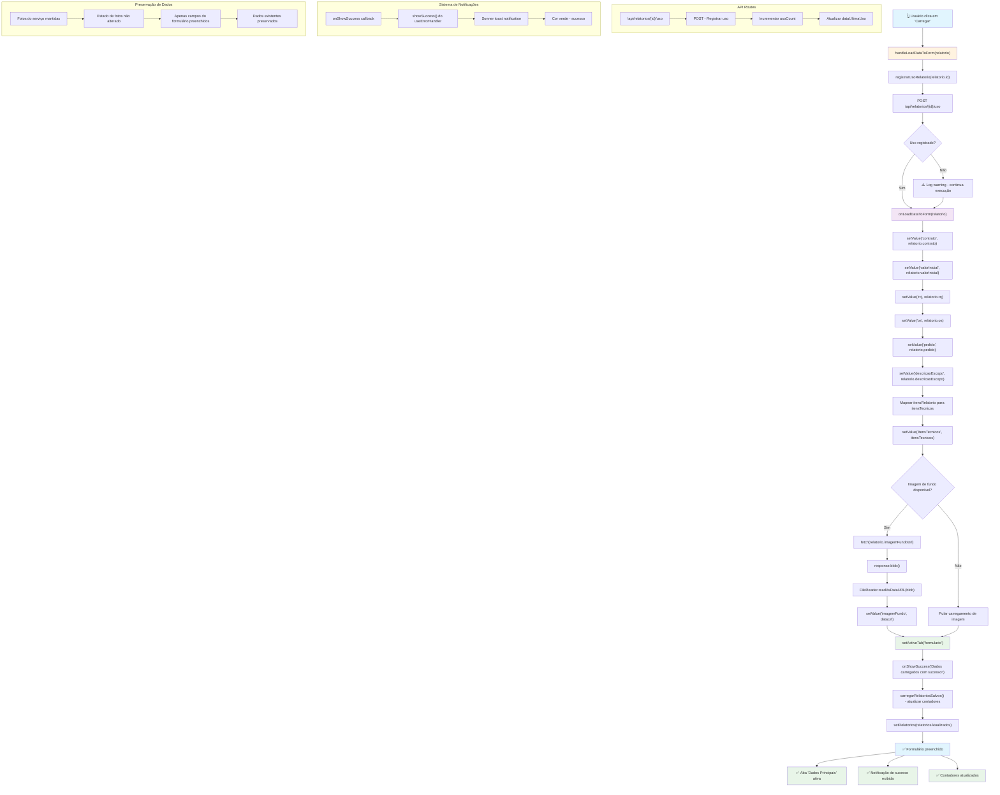

# Fluxo do Botão "Carregar" - Modelos Predefinidos

## Diagrama de Fluxo



## Análise Detalhada das Funções

### 1. Função Principal: `handleLoadDataToForm`

**Localização**: `src/app/relatorios/relatorio-tecnico/components/RelatorioSelector.tsx` (linhas 80-93)

**Funcionamento**:
- Recebe um objeto `RelatorioPredefinido` como parâmetro
- **Registra uso**: Chama `registrarUsoRelatorio(relatorio.id)` para incrementar contador de uso
- **Carrega dados**: Chama `onLoadDataToForm(relatorio)` para preencher o formulário
- **Exibe notificação**: Chama `onShowSuccess()` para mostrar confirmação de sucesso
- **Atualiza lista**: Recarrega a lista de relatórios para atualizar contadores
- **Tratamento de erros**: Se falhar ao registrar uso, continua a execução com warning

### 2. Função de Carregamento: `onLoadDataToForm`

**Localização**: `src/app/relatorios/relatorio-tecnico/page.tsx` (linhas 331-370)

**Funcionamento**:
- **Dados básicos**: Preenche campos do contrato usando `setValue()`
  - Contrato, Valor Inicial, RQ, OS, Pedido
- **Escopo**: Carrega descrição do escopo
- **Itens técnicos**: Mapeia `itensRelatorio` para `itensTecnicos` do formulário
- **Imagem de fundo**: Se disponível, converte URL para dataURL e carrega
- **Navegação automática**: Chama `setActiveTab("formulario")` para mudar de aba
- **Preservação**: Mantém fotos do serviço existentes inalteradas

### 3. Função de API: `registrarUsoRelatorio`

**Localização**: `src/lib/relatorios-api.ts` (linhas 132-144)

**Funcionamento**:
- Faz requisição POST para `/api/relatorios/{id}/uso`
- **Propósito**: Incrementar contador de uso e atualizar data de último uso
- **Tratamento de erros**: Se falhar, apenas loga warning (não interrompe fluxo)
- **Não bloqueante**: Erro não impede o carregamento dos dados

### 4. API Route: `/api/relatorios/{id}/uso`

**Localização**: `src/app/api/relatorios/[id]/uso/route.ts`

**Funcionamento**:
- Recebe requisição POST com ID do relatório
- **Incrementa uso**: Atualiza `usoCount` no banco de dados
- **Atualiza data**: Define `dataUltimaUso` para data atual
- **Retorna status**: HTTP 200 em caso de sucesso
- **Tratamento de erros**: Retorna status HTTP apropriados

### 5. Função de Carregamento de Lista: `carregarRelatoriosSalvos`

**Localização**: `src/lib/relatorios-api.ts` (linhas 30-43)

**Funcionamento**:
- Faz requisição GET para `/api/relatorios`
- **Propósito**: Obter lista atualizada de relatórios com contadores
- **Tratamento de erros**: Se falhar, retorna array vazio
- **Atualização**: Usado para refresh da lista após carregar modelo

## Fluxo de Dados do Banco

### Durante o Carregamento do Modelo:

1. **Registro de Uso**:
   ```sql
   UPDATE relatorio_predefinido 
   SET usoCount = usoCount + 1, 
       dataUltimaUso = NOW() 
   WHERE id = 'modelo-id'
   ```
   - Executada em: `/api/relatorios/{id}/uso` → `registrarUsoRelatorio()`
   - Propósito: Atualizar estatísticas de uso do modelo
   - **Comportamento**: Não bloqueante - falha não impede carregamento

2. **Carregamento da Lista Atualizada**:
   ```sql
   SELECT * FROM relatorio_predefinido 
   ORDER BY dataUltimaUso DESC
   ```
   - Executada em: `/api/relatorios` → `carregarRelatoriosSalvos()`
   - Propósito: Atualizar contadores na interface
   - **Comportamento**: Atualiza badges de uso e ordenação

### Observações Importantes:

- **Carregamento é local**: Os dados são carregados do banco para o estado local do React
- **Preservação de fotos**: Fotos do serviço existentes não são afetadas
- **Navegação automática**: Usuário é direcionado automaticamente para aba "Dados Principais"
- **Feedback visual**: Notificação de sucesso é exibida via toast
- **Contadores atualizados**: Lista de modelos é recarregada para mostrar uso atualizado
- **Arquitetura robusta**: Falhas em operações secundárias não impedem o carregamento principal

## Tratamento de Erros

1. **Erro ao registrar uso**: Loga warning mas continua execução
2. **Erro ao carregar lista**: Retorna array vazio, não impede carregamento
3. **Erro ao carregar imagem de fundo**: Loga warning, continua sem imagem
4. **Validação de dados**: Campos são preenchidos mesmo se alguns dados estiverem ausentes
5. **Sistema de notificações**: Sucesso sempre é exibido via toast notification
6. **API Route errors**: Erros são tratados e não interrompem o fluxo principal

## Estados do Componente

- `relatorios`: Array de modelos predefinidos carregados da API
- `busca`: Termo de busca para filtrar modelos
- `filtro`: Tipo de filtro aplicado (todos, maisUsados, recentes)
- `activeTab`: Controla qual aba está ativa (formulario/contratos)
- `formData`: Dados do formulário obtidos via `watch()`
- `fotos`: Array de fotos preservado durante carregamento
- `showSuccess`: Função do hook `useErrorHandler` para notificações

## Mudanças Implementadas

### ✅ Funcionalidades Implementadas:

1. **Botão Específico "Carregar"**:
   - Substituído clique automático por botão específico
   - Ícone de download para identificação visual
   - Posicionamento claro na interface

2. **Preservação de Fotos do Serviço**:
   - Fotos carregadas pelo usuário são mantidas inalteradas
   - Apenas campos do formulário são preenchidos
   - Estado de fotos não é sobrescrito

3. **Navegação Automática**:
   - Mudança automática para aba "Dados Principais"
   - Usuário não precisa navegar manualmente
   - Experiência fluida e intuitiva

4. **Feedback Visual**:
   - Notificação de sucesso com nome do modelo
   - Toast notification com cor verde
   - Confirmação clara da ação realizada

5. **Contadores Atualizados**:
   - Lista de modelos é recarregada após carregamento
   - Contadores de uso são atualizados em tempo real
   - Badges mostram uso atualizado

6. **Sistema Robusto**:
   - Falhas em operações secundárias não impedem carregamento
   - Tratamento de erros não bloqueante
   - Experiência consistente mesmo com problemas de rede

### ✅ Arquitetura Melhorada:

- **Separação de responsabilidades**: Carregamento de dados separado do registro de uso
- **API routes**: Operações de banco executadas apenas no servidor
- **Tratamento de erros**: Sistema robusto que não falha por problemas menores
- **Performance**: Carregamento otimizado com menos operações síncronas
- **UX**: Fluxo intuitivo com feedback visual claro

## Fluxo de Preservação de Dados

### ✅ Dados Preservados:
- **Fotos do serviço**: Array `fotos` não é modificado
- **Estado de vinculação**: Fotos vinculadas a itens mantêm suas ligações
- **Preview do PDF**: URL do preview não é limpa
- **Configurações**: Outras configurações do formulário são mantidas

### ✅ Dados Carregados:
- **Campos básicos**: Contrato, valor, RQ, OS, pedido
- **Escopo**: Descrição do escopo do modelo
- **Itens técnicos**: Lista de itens técnicos do modelo
- **Imagem de fundo**: Se disponível no modelo

### ✅ Comportamento Esperado:
- Usuário vê lista de modelos predefinidos
- Cada modelo tem botão "Carregar" específico
- Ao clicar, apenas campos do formulário são preenchidos
- Fotos do serviço permanecem inalteradas
- Usuário é direcionado automaticamente para aba "Dados Principais"
- Notificação de sucesso é exibida
- Contadores de uso são atualizados
