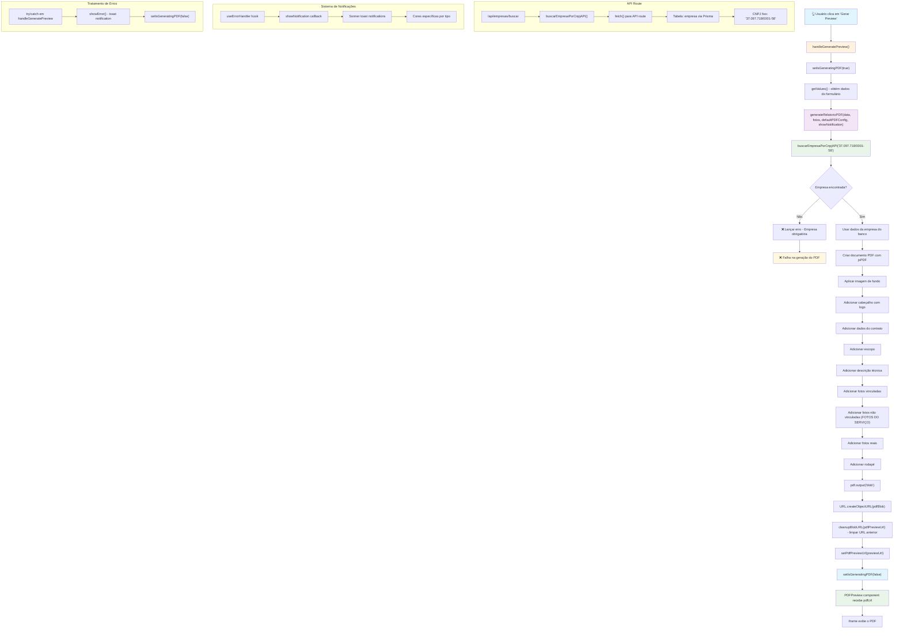

# Fluxo do Botão Preview PDF

## Diagrama de Fluxo



## Análise Detalhada das Funções

### 1. Função Principal: `handleGeneratePreview`

**Localização**: `src/app/relatorios/relatorio-tecnico/page.tsx` (linhas 154-175)

**Funcionamento**:
- Ativa o estado de carregamento (`setIsGeneratingPDF(true)`)
- Obtém os dados do formulário usando `getValues()`
- Chama `generateRelatorioPDF(data, fotos, defaultPDFConfig, showNotification)` para gerar o PDF
- Converte o PDF para blob e cria uma URL temporária
- Limpa a URL anterior se existir
- Atualiza o estado com a nova URL do preview
- Desativa o estado de carregamento
- **Tratamento de erros**: Usa `showError()` para exibir notificações toast em caso de erro

### 2. Função de Geração: `generateRelatorioPDF`

**Localização**: `src/lib/pdf-utils.ts` (linhas 12-262)

**Funcionamento**:
- Cria um novo documento PDF usando jsPDF
- **Busca dados da empresa**: Chama `buscarEmpresaPorCnpjAPI('37.097.718/0001-58')` via API route para obter informações da empresa
- **Validação obrigatória**: Se empresa não for encontrada, lança erro (não usa fallback)
- Aplica imagem de fundo se disponível
- Adiciona cabeçalho com logo da empresa
- Adiciona dados do contrato, escopo e descrição técnica
- Processa fotos vinculadas e não vinculadas
- **Seção de fotos**: Adiciona seção "FOTOS DO SERVIÇO" (renomeada de "FOTOS ADICIONAIS")
- Adiciona fotos reais ao PDF
- Adiciona rodapé com informações da empresa
- **Sistema de notificações**: Usa callback `onNotification` para exibir erros via toast
- Retorna o documento PDF completo

### 3. Função de API: `buscarEmpresaPorCnpjAPI`

**Localização**: `src/lib/pdf-utils.ts` (linhas 9-21)

**Funcionamento**:
- Faz requisição HTTP para `/api/empresas/buscar?cnpj=37.097.718/0001-58`
- Usa `fetch()` para chamar a API route
- Retorna dados da empresa em formato JSON
- Se não encontrar ou houver erro, lança exceção
- **Vantagem**: Evita execução do PrismaClient no browser

### 4. API Route: `/api/empresas/buscar`

**Localização**: `src/app/api/empresas/buscar/route.ts`

**Funcionamento**:
- Recebe requisição GET com parâmetro `cnpj`
- Chama `buscarEmpresaPorCnpj()` do arquivo `empresa-database.ts`
- Retorna dados da empresa em formato JSON
- Trata erros e retorna status HTTP apropriados
- **Segurança**: Executa PrismaClient apenas no servidor

### 5. Componente de Exibição: `PDFPreview`

**Localização**: `src/app/relatorios/relatorio-tecnico/components/PDFPreview.tsx`

**Funcionamento**:
- Recebe a URL do PDF como prop
- Exibe um iframe com o PDF quando disponível
- Mostra estado de carregamento durante a geração
- Exibe mensagem quando não há preview disponível

## Fluxo de Requisições ao Banco de Dados

### Durante o Preview do PDF:

1. **Consulta à Empresa Padrão via API**:
   ```sql
   SELECT * FROM empresa WHERE cnpj = '37.097.718/0001-58'
   ```
   - Executada em: `/api/empresas/buscar` → `buscarEmpresaPorCnpj('37.097.718/0001-58')`
   - Propósito: Obter dados da empresa (razão social, CNPJ, logo)
   - **Comportamento**: Se não encontrar, lança erro (dados obrigatórios)
   - **Arquitetura**: Cliente → API Route → Prisma → Banco de Dados

2. **Não há outras consultas diretas** durante o preview, pois:
   - Os dados do formulário vêm do estado local do React
   - As fotos estão em memória (dataURLs)
   - Apenas os dados da empresa são buscados do banco

### Observações Importantes:

- **Preview é local**: O preview não salva nada no banco, apenas gera o PDF em memória
- **Dados da empresa**: Única consulta ao banco durante o preview via API route
- **Performance**: O preview é rápido pois não há múltiplas consultas
- **Validação rigorosa**: Se a empresa não for encontrada, falha com erro (não há fallback)
- **Arquitetura segura**: PrismaClient executa apenas no servidor, evitando erros de browser
- **Sistema de notificações**: Erros são exibidos via toast notifications (Sonner)

## Tratamento de Erros

1. **Erro na geração do PDF**: Capturado no `try/catch` do `handleGeneratePreview`
2. **Erro ao buscar empresa**: Lança erro se empresa não for encontrada (dados obrigatórios)
3. **Erro ao carregar imagens**: Capturado individualmente para cada foto
4. **Limpeza de recursos**: URLs de blob são limpas para evitar vazamentos de memória
5. **Sistema de notificações**: Todos os erros são exibidos via toast notifications com cores específicas
6. **API Route errors**: Erros de API são tratados e retornados com status HTTP apropriados

## Estados do Componente

- `isGeneratingPDF`: Controla o estado de carregamento
- `pdfPreviewUrl`: Armazena a URL do PDF gerado
- `fotos`: Array de fotos em memória com dataURLs
- `formData`: Dados do formulário obtidos via `watch()`
- `showError`, `showSuccess`, `showNotification`: Funções do hook `useErrorHandler` para notificações

## Mudanças Implementadas

### ✅ Correções Aplicadas:

1. **PrismaClient Browser Error**: 
   - Criada API route `/api/empresas/buscar`
   - Implementada função `buscarEmpresaPorCnpjAPI()` usando `fetch()`
   - PrismaClient agora executa apenas no servidor

2. **Sistema de Notificações**:
   - Integrado Sonner no layout principal
   - Criado hook `useErrorHandler` com funções específicas
   - Substituído `alert()` por toast notifications
   - Cores e designs específicos por tipo de notificação

3. **Duplicidade de Seção**:
   - Corrigida duplicação de "FOTOS ADICIONAIS"
   - Renomeada seção para "FOTOS DO SERVIÇO"

4. **Arquitetura Melhorada**:
   - Separação clara entre cliente e servidor
   - Tratamento de erros centralizado
   - Performance otimizada com menos consultas diretas ao banco
