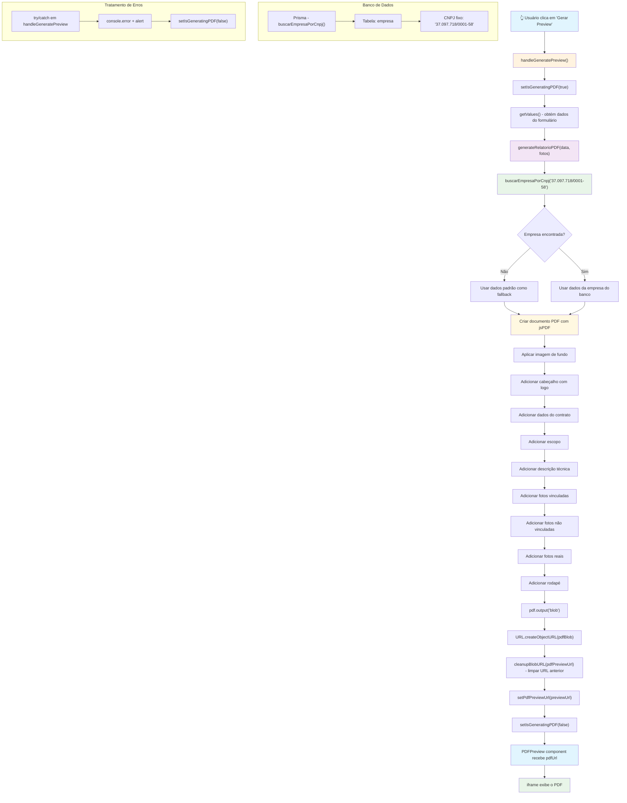

# Fluxo do Botão Preview PDF

## Diagrama de Fluxo



## Análise Detalhada das Funções

### 1. Função Principal: `handleGeneratePreview`

**Localização**: `src/app/relatorios/relatorio-tecnico/page.tsx` (linhas 154-175)

**Funcionamento**:
- Ativa o estado de carregamento (`setIsGeneratingPDF(true)`)
- Obtém os dados do formulário usando `getValues()`
- Chama `generateRelatorioPDF(data, fotos)` para gerar o PDF
- Converte o PDF para blob e cria uma URL temporária
- Limpa a URL anterior se existir
- Atualiza o estado com a nova URL do preview
- Desativa o estado de carregamento

### 2. Função de Geração: `generateRelatorioPDF`

**Localização**: `src/lib/pdf-utils.ts` (linhas 12-262)

**Funcionamento**:
- Cria um novo documento PDF usando jsPDF
- **Busca dados da empresa**: Chama `buscarEmpresaPorCnpj('37.097.718/0001-58')` para obter informações da empresa
- Aplica imagem de fundo se disponível
- Adiciona cabeçalho com logo da empresa
- Adiciona dados do contrato, escopo e descrição técnica
- Processa fotos vinculadas e não vinculadas
- Adiciona fotos reais ao PDF
- Adiciona rodapé com informações da empresa
- Retorna o documento PDF completo

### 3. Função de Banco de Dados: `buscarEmpresaPorCnpj`

**Localização**: `src/lib/empresa-database.ts` (linhas 156-190)

**Funcionamento**:
- Busca empresa com CNPJ fixo `"37.097.718/0001-58"`
- Usa Prisma para consultar a tabela `empresa`
- Retorna dados da empresa incluindo relatórios relacionados
- Se não encontrar, retorna `null` (tratado no pdf-utils)

### 4. Componente de Exibição: `PDFPreview`

**Localização**: `src/app/relatorios/relatorio-tecnico/components/PDFPreview.tsx`

**Funcionamento**:
- Recebe a URL do PDF como prop
- Exibe um iframe com o PDF quando disponível
- Mostra estado de carregamento durante a geração
- Exibe mensagem quando não há preview disponível

## Fluxo de Requisições ao Banco de Dados

### Durante o Preview do PDF:

1. **Consulta à Empresa Padrão**:
   ```sql
   SELECT * FROM empresa WHERE cnpj = '37.097.718/0001-58'
   ```
   - Executada em: `buscarEmpresaPorCnpj('37.097.718/0001-58')`
   - Propósito: Obter dados da empresa (razão social, CNPJ, logo)
   - Fallback: Se não encontrar, usa dados hardcoded

2. **Não há outras consultas diretas** durante o preview, pois:
   - Os dados do formulário vêm do estado local do React
   - As fotos estão em memória (dataURLs)
   - Apenas os dados da empresa são buscados do banco

### Observações Importantes:

- **Preview é local**: O preview não salva nada no banco, apenas gera o PDF em memória
- **Dados da empresa**: Única consulta ao banco durante o preview
- **Performance**: O preview é rápido pois não há múltiplas consultas
- **Fallback robusto**: Se a empresa não for encontrada, usa dados padrão

## Tratamento de Erros

1. **Erro na geração do PDF**: Capturado no `try/catch` do `handleGeneratePreview`
2. **Erro ao buscar empresa**: Capturado no `try/catch` do `generateRelatorioPDF`
3. **Erro ao carregar imagens**: Capturado individualmente para cada foto
4. **Limpeza de recursos**: URLs de blob são limpas para evitar vazamentos de memória

## Estados do Componente

- `isGeneratingPDF`: Controla o estado de carregamento
- `pdfPreviewUrl`: Armazena a URL do PDF gerado
- `fotos`: Array de fotos em memória com dataURLs
- `formData`: Dados do formulário obtidos via `watch()`
